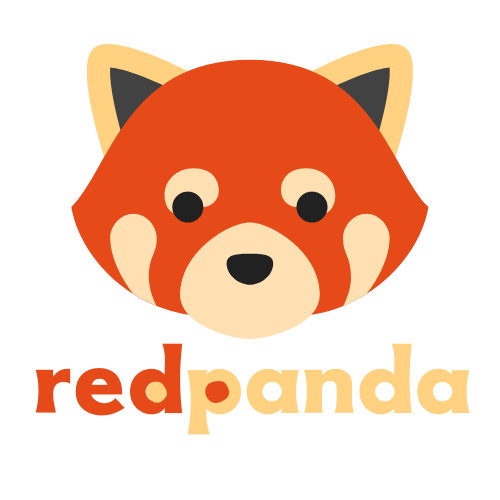

# Red Panda

Who said learning couldn't be fun! Red Panda is an interactive app to learn basic sign language. Mimic the hand gestures on the screen to learn ASL (American Sign Language), the more you learn the more tests you can unlock. Earn points as you go and fight for a spot on the leaderboard!

 

# Tech Stack

Red Panda was built using React and Redux for state management on the front-end, and was styled using TailwindCSS. Hand detection was done using the Handpose and Fingerpose models from Tensorflow.js. The back-end and database was done using Express, Sequelize, Postgres and Node.js.

# Setup & Start

1. Install dependencies: `npm install`
2. Sync and seed your database by running `npm run seed`
3. Use `npm run start:dev` to start a local server (on port 8080)

# How to play

1. Make an account and log in
2. Complete a lesson by mimicking the hand gestures on the screen
3. Unlock tests as you complete lessons
4. Complete a test by either showing the hand gesture given the letter or typing in the letter given the gesture.
5. Earn points as you complete lessons and tests and see if you can top the leaderboard!

<h1 align='center'>
Play here: https://redpandaasl.herokuapp.com/
</h1>

# Team

1. Sabi Kumar: https://github.com/skumar213 | http://www.linkedin.com/in/skumar213
2. Max Boykin: https://github.com/Maxxboykin | https://www.linkedin.com/in/maxboykin/
3. Peter Oehman: https://github.com/PeterOehman | https://www.linkedin.com/in/peter-oehman/
4. Brendan Shulman: https://github.com/bshulman210 | https://www.linkedin.com/in/brendan-shulman/
